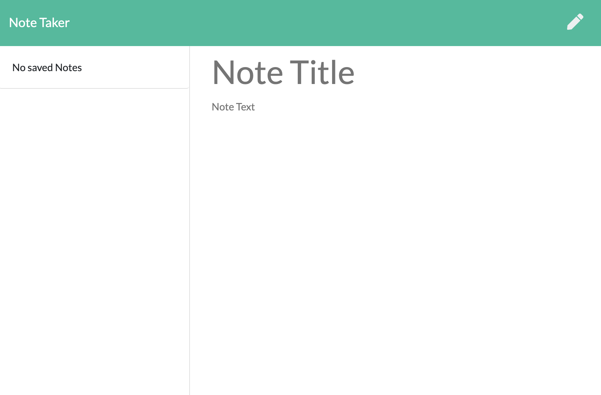

  # Note Taker
  

  ## Preview
  
  

  ## Description
  * Note Taker helps you create, read, and delete notes.
  * Deployed application on Heroku: https://frozen-fortress-40163.herokuapp.com/

  ## Table of Contents
  * [Installation](#Installation)
  * [Usage](#Usage)
  * [License](#License)
  * [Contributing](#Contributing)
  * [Questions](#Questions)

  ## Installation
  To install necessary dependencies, run the following command:

      npm install

  ## Usage
  1. Fork this repository to your folder and install dependencies.
  2. Use the Note Taker app by running `node server.js` in Node.js. 
  3. Notes that have been created cannot be edited.

  Alternatively, to use this app directly, click on the link under [Description](#Description). Click on get started to create notes.

  ## License
  * MIT

  ## Contributing
  The app is contributed by Melody Lo and Trilogy Education Services.

  ## Questions
  * If you have any questions, feel free to contact me via email: yiling.melody.lo@gmail.com
  * My GitHub profile: https://github.com/roukell

  
  